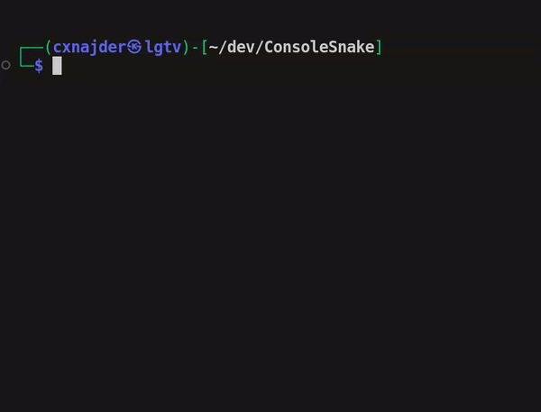

# ASCII Snake In Console/Terminal Window

## Description
The snake is inspired on tutorial videos from https://www.youtube.com/@NVitanovic
Te changes I made are:
- enclosed the game in a c++ class (instead of using global variables and functions)
- added linux equivalents of `_kbhit()` and `_getch()` from `<conio.h>` for Linux with a healp of `if defined()` macros. (The `<conio.h>` library is supported only on Windows)
- used my own coding style

## Demo

  

